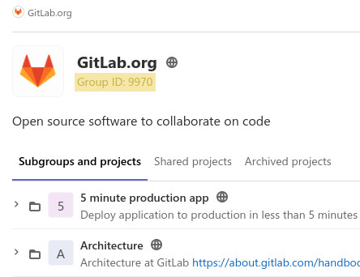

# gitlabfs

`gitlabfs` allows you to mount and navigate Gitlab groups and user personal projects as a FUSE filesystem with every groups represented as a folder and every projects represented as a symlink pointing on a local clone of the project.

Partial output of `tree`, truncated and with a max of 4 levels:
```
$ tree -L 4
.
├── projects
│   └── gitlab-org
│       ├── 5-minute-production-app
│       │   ├── deploy-template -> /home/marchambault/.local/share/gitlabfs/gitlab.com/22487050
│       │   ├── examples
│       │   ├── hipio -> /home/marchambault/.local/share/gitlabfs/gitlab.com/23344605
│       │   ├── sandbox
│       │   └── static-template -> /home/marchambault/.local/share/gitlabfs/gitlab.com/23203100
│       ├── allocations -> /home/marchambault/.local/share/gitlabfs/gitlab.com/684698
│       ├── apilab -> /home/marchambault/.local/share/gitlabfs/gitlab.com/2383700
│       ├── architecture
│       │   └── tasks -> /home/marchambault/.local/share/gitlabfs/gitlab.com/22351703
│       ├── async-retrospectives -> /home/marchambault/.local/share/gitlabfs/gitlab.com/7937396
│       ├── auto-deploy-app -> /home/marchambault/.local/share/gitlabfs/gitlab.com/6329546
│       ├── auto-deploy-helm -> /home/marchambault/.local/share/gitlabfs/gitlab.com/3651684
│       ├── auto-devops-v12-10 -> /home/marchambault/.local/share/gitlabfs/gitlab.com/18629149
│       ├── backstage-changelog -> /home/marchambault/.local/share/gitlabfs/gitlab.com/7602162
│       ├── blob-examples -> /home/marchambault/.local/share/gitlabfs/gitlab.com/3094319
│       ├── build
│       │   ├── CNG -> /home/marchambault/.local/share/gitlabfs/gitlab.com/4359271
│       │   ├── CNG-mirror -> /home/marchambault/.local/share/gitlabfs/gitlab.com/7682093
│       │   ├── dsop-scripts -> /home/marchambault/.local/share/gitlabfs/gitlab.com/19310217
│       │   ├── omnibus-mirror
│       │   └── tr-test-dependency-proxy -> /home/marchambault/.local/share/gitlabfs/gitlab.com/20085049
│       ├── charts
│       │   ├── apparmor -> /home/marchambault/.local/share/gitlabfs/gitlab.com/18991900
│       │   ├── auto-deploy-app -> /home/marchambault/.local/share/gitlabfs/gitlab.com/11915984
│       │   ├── components
│       │   ├── consul -> /home/marchambault/.local/share/gitlabfs/gitlab.com/18663049
│       │   ├── deploy-image-helm-base -> /home/marchambault/.local/share/gitlabfs/gitlab.com/7453181
│       │   ├── elastic-stack -> /home/marchambault/.local/share/gitlabfs/gitlab.com/18439881
│       │   ├── fluentd-elasticsearch -> /home/marchambault/.local/share/gitlabfs/gitlab.com/17253921
│       │   ├── gitlab -> /home/marchambault/.local/share/gitlabfs/gitlab.com/3828396
│       │   ├── gitlab-runner -> /home/marchambault/.local/share/gitlabfs/gitlab.com/6329679
│       │   ├── knative -> /home/marchambault/.local/share/gitlabfs/gitlab.com/16590122
│       │   └── plantuml -> /home/marchambault/.local/share/gitlabfs/gitlab.com/14372596
│       [...]
└── users
    └── badjware
        └── test_project -> /home/marchambault/.local/share/gitlabfs/gitlab.com/23370783

696 directories, 0 files
```


## Install

Install [go](https://golang.org/) and run
``` sh
go get github.com/badjware/gitlabfs
```

The executable will be in `$GOPATH/bin/gitlabfs` or `~/go/bin/gitlabfs` by default. For convenience, copy `gitlabfs` somewhere suitable or add `~/go/bin` in your `PATH`.

## Usage

Download the [example configuration file](./config.example.yaml) and edit the default configuration to suit your needs.

### Getting an API token

To generate an api token, log into your Gitlab instance, and go in your user settings > Access Token. Create a personal access token with the following permissions at the minimum:
* `read_user`
* `read_api`

### Getting the group ids

The group id can be seen just under the name of the group in Gitlab.



### Getting the user ids

Log into gitlab and go to https://gitlab.com/api/v4/users?username=USERNAME where `USERNAME` is the username of the user you wish to know the id of. The json response will contain the user id.

See https://forum.gitlab.com/t/where-is-my-user-id-in-gitlab-com/7912

### Mounting the filesystem

You can mount the filesystem with the following command:
``` sh
~/go/bin/gitlabfs -config /path/to/your/config.yaml /path/to/mountpoint
```
Once the filesystem is mounted, you can `cd` into it and navigate it like any other filesystem. The first time `ls` is run the list of groups and projects is fetched from Gitlab. This operation can take a few seconds and the command will appear frozen until it's completed. Subsequent `ls` will fetch from the cache and should be much faster.

If `on_clone` is set to `init` or `no-checkout`, the locally cloned project will appear empty. Simply running `git pull` manually in the project folder will sync it up with Gitlab.

### Unmounting the filesystem

To stop the filesystem, use the command `umount /path/to/mountpoint` to cleanly unmount the filesystem.

If `gitlabfs` is not cleanly stopped, you might start seeing the error "transport endpoint is not connected" when trying to access the mountpoint, even preventing from mounting back the filesystem on the same mountpoint. To fix this, use `umount` as root user, eg: `sudo umount /path/to/mountpoint`.

## Caching

To reduce the number of calls to the Gitlab api and improve the responsiveness of the filesystem, `gitlabfs` will cache the content of the group in memory. If a group or project is renamed, created or deleted from Gitlab, these change will not appear in the filesystem. To force `gitlabfs` to refresh its cache, use `touch .refresh` in the folder to refresh to force `gitlabfs` to query Gitlab for the list of groups and projects again.

While the filesystem lives in memory, the git repositories that are cloned are saved on disk. By default, they are saved in `$XDG_DATA_HOME/gitlabfs` or `$HOME/.local/share/gitlabfs`, if `$XDG_DATA_HOME` is unset. `gitlabfs` symlink to the local clone of that repo. The local clone is unaffected by project rename or archive/unarchive in Gitlab and a given project will always point to the correct local folder.

## Known issues / Future improvements
* There is a race condition that could happen when interacting with git that needs to be fixed.
* Cloning and pulling repositories is currently very resource-intensive, especially on large set of repositories. Need to track down what causes this to happen. For now, leaving `on_clone` set to `init` and `auto_pull` to `false` in the configuration avoids the issue.
* Cache persists forever until a manual refresh is requested. Some way to automatically refresh would be nice.
* The filesystem is currently read-only. Implementing `mkdir` to create groups, `ln` or `touch` to create projects, etc. would be nice.
* Code need some cleanup and could maybe be optimized here and there.

## Building

Simply use `make` to create the executable. The executable will be in `bin/`.

See `make help` for all available targets.